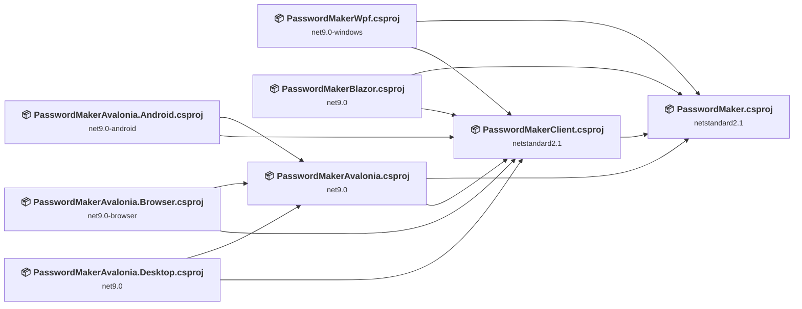
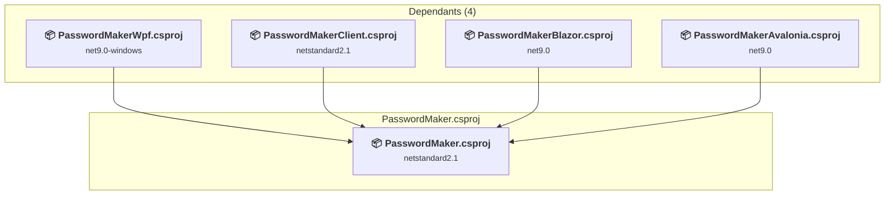
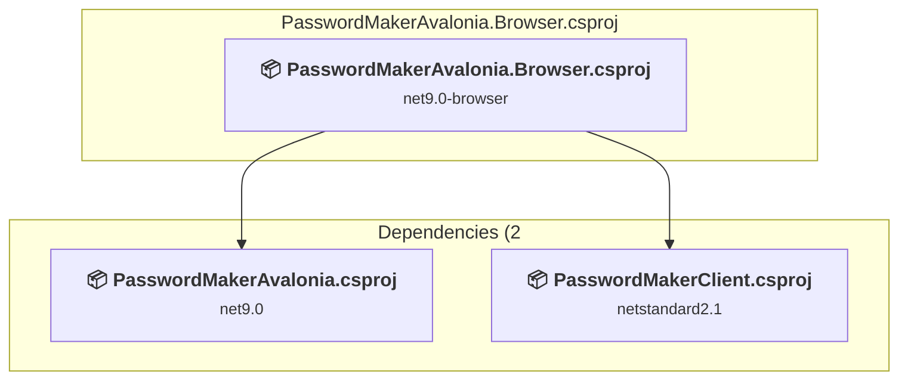
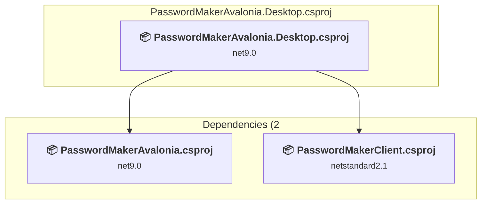
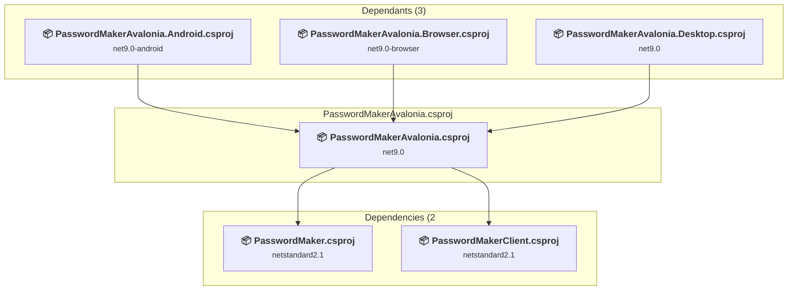
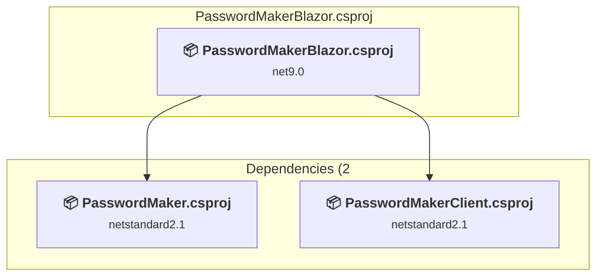
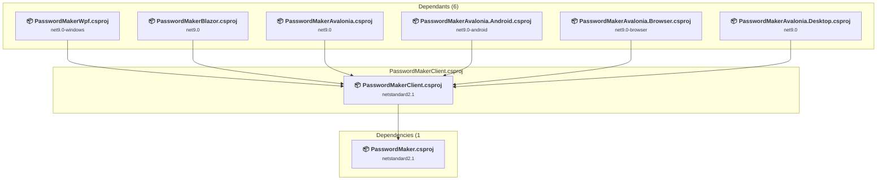
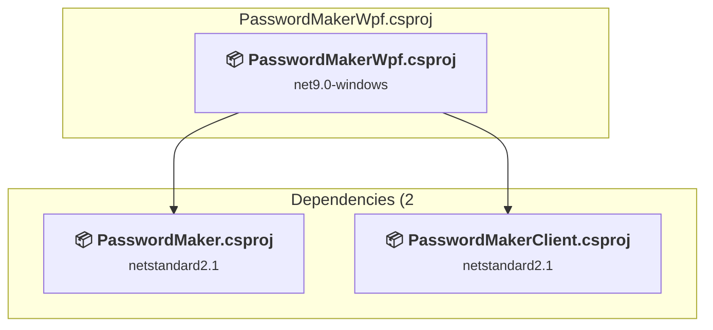

# Projects and dependencies analysis

This document provides a comprehensive overview of the projects and their dependencies in the context of upgrading to .NETCoreApp,Version=v10.0.

## Table of Contents

- [Executive Summary](#executive-Summary)
  - [Highlevel Metrics](#highlevel-metrics)
  - [Projects Compatibility](#projects-compatibility)
  - [Package Compatibility](#package-compatibility)
  - [API Compatibility](#api-compatibility)
- [Aggregate NuGet packages details](#aggregate-nuget-packages-details)
- [Top API Migration Challenges](#top-api-migration-challenges)
  - [Technologies and Features](#technologies-and-features)
  - [Most Frequent API Issues](#most-frequent-api-issues)
- [Projects Relationship Graph](#projects-relationship-graph)
- [Project Details](#project-details)

  - [PasswordMaker\PasswordMaker.csproj](#passwordmakerpasswordmakercsproj)
  - [PasswordMakerAvalonia.Android\PasswordMakerAvalonia.Android.csproj](#passwordmakeravaloniaandroidpasswordmakeravaloniaandroidcsproj)
  - [PasswordMakerAvalonia.Browser\PasswordMakerAvalonia.Browser.csproj](#passwordmakeravaloniabrowserpasswordmakeravaloniabrowsercsproj)
  - [PasswordMakerAvalonia.Desktop\PasswordMakerAvalonia.Desktop.csproj](#passwordmakeravaloniadesktoppasswordmakeravaloniadesktopcsproj)
  - [PasswordMakerAvalonia\PasswordMakerAvalonia.csproj](#passwordmakeravaloniapasswordmakeravaloniacsproj)
  - [PasswordMakerBlazor\PasswordMakerBlazor.csproj](#passwordmakerblazorpasswordmakerblazorcsproj)
  - [PasswordMakerClient\PasswordMakerClient.csproj](#passwordmakerclientpasswordmakerclientcsproj)
  - [PasswordMakerWpf\PasswordMakerWpf.csproj](#passwordmakerwpfpasswordmakerwpfcsproj)

## Executive Summary

### Highlevel Metrics

| Metric | Count | Status |
| :--- | :---: | :--- |
| Total Projects | 8 | 7 require upgrade |
| Total NuGet Packages | 15 | 6 need upgrade |
| Total Code Files | 33 |  |
| Total Code Files with Incidents | 20 |  |
| Total Lines of Code | 1963 |  |
| Total Number of Issues | 339 |  |
| Estimated LOC to modify | 326+ | at least 16.6% of codebase |

### Projects Compatibility

| Project | Target Framework | Difficulty | Package Issues | API Issues | Est. LOC Impact | Description |
| :--- | :---: | :---: | :---: | :---: | :---: | :--- |
| [PasswordMaker\PasswordMaker.csproj](#passwordmakerpasswordmakercsproj) | netstandard2.1 | 🟢 Low | 1 | 0 |  | ClassLibrary, Sdk Style = True |
| [PasswordMakerAvalonia.Android\PasswordMakerAvalonia.Android.csproj](#passwordmakeravaloniaandroidpasswordmakeravaloniaandroidcsproj) | net9.0-android | 🟢 Low | 2 | 0 |  | ClassLibrary, Sdk Style = True |
| [PasswordMakerAvalonia.Browser\PasswordMakerAvalonia.Browser.csproj](#passwordmakeravaloniabrowserpasswordmakeravaloniabrowsercsproj) | net9.0-browser | 🟢 Low | 1 | 3 | 3+ | AspNetCore, Sdk Style = True |
| [PasswordMakerAvalonia.Desktop\PasswordMakerAvalonia.Desktop.csproj](#passwordmakeravaloniadesktoppasswordmakeravaloniadesktopcsproj) | net9.0 | 🟢 Low | 0 | 0 |  | WinForms, Sdk Style = True |
| [PasswordMakerAvalonia\PasswordMakerAvalonia.csproj](#passwordmakeravaloniapasswordmakeravaloniacsproj) | net9.0 | 🟢 Low | 0 | 0 |  | ClassLibrary, Sdk Style = True |
| [PasswordMakerBlazor\PasswordMakerBlazor.csproj](#passwordmakerblazorpasswordmakerblazorcsproj) | net9.0 | 🟢 Low | 3 | 3 | 3+ | AspNetCore, Sdk Style = True |
| [PasswordMakerClient\PasswordMakerClient.csproj](#passwordmakerclientpasswordmakerclientcsproj) | netstandard2.1 | ✅ None | 0 | 0 |  | ClassLibrary, Sdk Style = True |
| [PasswordMakerWpf\PasswordMakerWpf.csproj](#passwordmakerwpfpasswordmakerwpfcsproj) | net9.0-windows | 🟡 Medium | 0 | 320 | 320+ | Wpf, Sdk Style = True |

### Package Compatibility

| Status | Count | Percentage |
| :--- | :---: | :---: |
| ✅ Compatible | 9 | 60.0% |
| ⚠️ Incompatible | 2 | 13.3% |
| 🔄 Upgrade Recommended | 4 | 26.7% |
| ***Total NuGet Packages*** | ***15*** | ***100%*** |

### API Compatibility

| Category | Count | Impact |
| :--- | :---: | :--- |
| 🔴 Binary Incompatible | 307 | High - Require code changes |
| 🟡 Source Incompatible | 0 | Medium - Needs re-compilation and potential conflicting API error fixing |
| 🔵 Behavioral change | 19 | Low - Behavioral changes that may require testing at runtime |
| ✅ Compatible | 4427 |  |
| ***Total APIs Analyzed*** | ***4753*** |  |

## Aggregate NuGet packages details

| Package | Current Version | Suggested Version | Projects | Description |
| :--- | :---: | :---: | :--- | :--- |
| Avalonia | 11.2.2 |  | [PasswordMakerAvalonia.csproj](#passwordmakeravaloniapasswordmakeravaloniacsproj) | ✅Compatible |
| Avalonia.Android | 11.2.2 |  | [PasswordMakerAvalonia.Android.csproj](#passwordmakeravaloniaandroidpasswordmakeravaloniaandroidcsproj) | ⚠️NuGet package is incompatible |
| Avalonia.Browser | 11.2.2 |  | [PasswordMakerAvalonia.Browser.csproj](#passwordmakeravaloniabrowserpasswordmakeravaloniabrowsercsproj) | ✅Compatible |
| Avalonia.Desktop | 11.2.2 |  | [PasswordMakerAvalonia.Desktop.csproj](#passwordmakeravaloniadesktoppasswordmakeravaloniadesktopcsproj) | ✅Compatible |
| Avalonia.Diagnostics | 11.2.2 |  | [PasswordMakerAvalonia.csproj](#passwordmakeravaloniapasswordmakeravaloniacsproj) | ✅Compatible |
| Avalonia.Fonts.Inter | 11.2.2 |  | [PasswordMakerAvalonia.csproj](#passwordmakeravaloniapasswordmakeravaloniacsproj) | ✅Compatible |
| Avalonia.Themes.Fluent | 11.2.2 |  | [PasswordMakerAvalonia.csproj](#passwordmakeravaloniapasswordmakeravaloniacsproj) | ✅Compatible |
| MaterialDesignThemes | 5.1.0 |  | [PasswordMakerWpf.csproj](#passwordmakerwpfpasswordmakerwpfcsproj) | ✅Compatible |
| Microsoft.AspNetCore.Components.WebAssembly | 9.0.0 | 10.0.1 | [PasswordMakerBlazor.csproj](#passwordmakerblazorpasswordmakerblazorcsproj) | NuGet package upgrade is recommended |
| Microsoft.AspNetCore.Components.WebAssembly.DevServer | 9.0.0 | 10.0.1 | [PasswordMakerBlazor.csproj](#passwordmakerblazorpasswordmakerblazorcsproj) | NuGet package upgrade is recommended |
| Microsoft.FluentUI.AspNetCore.Components | 4.*-* |  | [PasswordMakerBlazor.csproj](#passwordmakerblazorpasswordmakerblazorcsproj) | ✅Compatible |
| Microsoft.FluentUI.AspNetCore.Components.Icons | 4.*-* |  | [PasswordMakerBlazor.csproj](#passwordmakerblazorpasswordmakerblazorcsproj) | ✅Compatible |
| Microsoft.JSInterop | 9.0.0 | 10.0.1 | [PasswordMakerAvalonia.Browser.csproj](#passwordmakeravaloniabrowserpasswordmakeravaloniabrowsercsproj) [PasswordMakerBlazor.csproj](#passwordmakerblazorpasswordmakerblazorcsproj) | NuGet package upgrade is recommended |
| System.Text.Json | 9.0.0 | 10.0.1 | [PasswordMaker.csproj](#passwordmakerpasswordmakercsproj) | NuGet package upgrade is recommended |
| Xamarin.AndroidX.Core.SplashScreen | 1.0.1.13 |  | [PasswordMakerAvalonia.Android.csproj](#passwordmakeravaloniaandroidpasswordmakeravaloniaandroidcsproj) | ⚠️NuGet package is incompatible |

## Top API Migration Challenges

### Technologies and Features

| Technology | Issues | Percentage | Migration Path |
| :--- | :---: | :---: | :--- |
| WPF (Windows Presentation Foundation) | 159 | 48.8% | WPF APIs for building Windows desktop applications with XAML-based UI that are available in .NET on Windows. WPF provides rich desktop UI capabilities with data binding and styling. Enable Windows Desktop support: Option 1 (Recommended): Target net9.0-windows; Option 2: Add <UseWindowsDesktop>true</UseWindowsDesktop>. |

### Most Frequent API Issues

| API | Count | Percentage | Category |
| :--- | :---: | :---: | :--- |
| T:System.Windows.Controls.TextBox | 18 | 5.5% | Binary Incompatible |
| T:System.Windows.Controls.TextBlock | 13 | 4.0% | Binary Incompatible |
| T:System.Windows.Controls.Grid | 13 | 4.0% | Binary Incompatible |
| T:System.Windows.Input.Key | 11 | 3.4% | Binary Incompatible |
| T:System.Windows.RoutedEventHandler | 10 | 3.1% | Binary Incompatible |
| T:System.Windows.RoutedEventArgs | 10 | 3.1% | Binary Incompatible |
| T:System.Windows.DependencyProperty | 10 | 3.1% | Binary Incompatible |
| T:System.Uri | 9 | 2.8% | Behavioral Change |
| T:System.Windows.GridLength | 9 | 2.8% | Binary Incompatible |
| P:System.Windows.Controls.TextBlock.Text | 7 | 2.1% | Binary Incompatible |
| T:System.Windows.Application | 6 | 1.8% | Binary Incompatible |
| M:System.Uri.#ctor(System.String,System.UriKind) | 6 | 1.8% | Behavioral Change |
| M:System.Windows.Controls.UserControl.#ctor | 6 | 1.8% | Binary Incompatible |
| T:System.Windows.Input.KeyEventHandler | 6 | 1.8% | Binary Incompatible |
| P:System.Windows.RoutedEventArgs.Handled | 6 | 1.8% | Binary Incompatible |
| T:System.Windows.Visibility | 6 | 1.8% | Binary Incompatible |
| M:System.Windows.Application.LoadComponent(System.Object,System.Uri) | 5 | 1.5% | Binary Incompatible |
| T:System.Windows.Controls.CheckBox | 5 | 1.5% | Binary Incompatible |
| P:System.Windows.Controls.TextBox.Text | 5 | 1.5% | Binary Incompatible |
| P:System.Windows.FrameworkElement.DataContext | 4 | 1.2% | Binary Incompatible |
| T:System.Windows.Markup.IComponentConnector | 4 | 1.2% | Binary Incompatible |
| T:System.Windows.Input.TextCompositionEventHandler | 4 | 1.2% | Binary Incompatible |
| M:System.Windows.DataObjectEventArgs.CancelCommand | 4 | 1.2% | Binary Incompatible |
| T:System.Windows.DataFormats | 4 | 1.2% | Binary Incompatible |
| F:System.Windows.DataFormats.Text | 4 | 1.2% | Binary Incompatible |
| T:System.Windows.IDataObject | 4 | 1.2% | Binary Incompatible |
| P:System.Windows.DataObjectPastingEventArgs.DataObject | 4 | 1.2% | Binary Incompatible |
| M:System.Windows.DependencyObject.SetValue(System.Windows.DependencyProperty,System.Object) | 3 | 0.9% | Binary Incompatible |
| M:System.Windows.DependencyObject.GetValue(System.Windows.DependencyProperty) | 3 | 0.9% | Binary Incompatible |
| T:System.Windows.Controls.UserControl | 3 | 0.9% | Binary Incompatible |
| T:System.Windows.Input.KeyEventArgs | 3 | 0.9% | Binary Incompatible |
| P:System.Windows.Input.KeyEventArgs.Key | 3 | 0.9% | Binary Incompatible |
| T:System.Windows.Thickness | 3 | 0.9% | Binary Incompatible |
| P:System.Windows.GridLength.Auto | 3 | 0.9% | Binary Incompatible |
| T:System.Windows.DataObject | 3 | 0.9% | Binary Incompatible |
| M:System.Windows.DataObject.AddPastingHandler(System.Windows.DependencyObject,System.Windows.DataObjectPastingEventHandler) | 3 | 0.9% | Binary Incompatible |
| M:System.Windows.UIElement.Focus | 3 | 0.9% | Binary Incompatible |
| M:System.Uri.#ctor(System.String) | 2 | 0.6% | Behavioral Change |
| P:System.Uri.AbsolutePath | 2 | 0.6% | Behavioral Change |
| E:System.Windows.UIElement.PreviewKeyDown | 2 | 0.6% | Binary Incompatible |
| E:System.Windows.UIElement.PreviewTextInput | 2 | 0.6% | Binary Incompatible |
| T:System.Windows.DataObjectPastingEventArgs | 2 | 0.6% | Binary Incompatible |
| M:System.Windows.IDataObject.GetData(System.String) | 2 | 0.6% | Binary Incompatible |
| M:System.Windows.IDataObject.GetDataPresent(System.String) | 2 | 0.6% | Binary Incompatible |
| F:System.Windows.Input.Key.Space | 2 | 0.6% | Binary Incompatible |
| T:System.Windows.Input.TextCompositionEventArgs | 2 | 0.6% | Binary Incompatible |
| P:System.Windows.Input.TextCompositionEventArgs.Text | 2 | 0.6% | Binary Incompatible |
| T:System.Windows.Controls.UIElementCollection | 2 | 0.6% | Binary Incompatible |
| P:System.Windows.Controls.Panel.Children | 2 | 0.6% | Binary Incompatible |
| M:System.Windows.Controls.UIElementCollection.Add(System.Windows.UIElement) | 2 | 0.6% | Binary Incompatible |

## Projects Relationship Graph

Legend:
📦 SDK-style project
⚙️ Classic project

## Project Details

### PasswordMaker\PasswordMaker.csproj

#### Project Info

- **Current Target Framework:** netstandard2.1✅
- **SDK-style**: True
- **Project Kind:** ClassLibrary
- **Dependencies**: 0
- **Dependants**: 4
- **Number of Files**: 5
- **Number of Files with Incidents**: 1
- **Lines of Code**: 543
- **Estimated LOC to modify**: 0+ (at least 0.0% of the project)

#### Dependency Graph

Legend:
📦 SDK-style project
⚙️ Classic project

### API Compatibility

| Category | Count | Impact |
| :--- | :---: | :--- |
| 🔴 Binary Incompatible | 0 | High - Require code changes |
| 🟡 Source Incompatible | 0 | Medium - Needs re-compilation and potential conflicting API error fixing |
| 🔵 Behavioral change | 0 | Low - Behavioral changes that may require testing at runtime |
| ✅ Compatible | 493 |  |
| ***Total APIs Analyzed*** | ***493*** |  |

### PasswordMakerAvalonia.Android\PasswordMakerAvalonia.Android.csproj

#### Project Info

- **Current Target Framework:** net9.0-android
- **Proposed Target Framework:** net10.0-android
- **SDK-style**: True
- **Project Kind:** ClassLibrary
- **Dependencies**: 2
- **Dependants**: 0
- **Number of Files**: 2
- **Number of Files with Incidents**: 1
- **Lines of Code**: 56
- **Estimated LOC to modify**: 0+ (at least 0.0% of the project)

#### Dependency Graph

Legend:
📦 SDK-style project
⚙️ Classic project

### API Compatibility

| Category | Count | Impact |
| :--- | :---: | :--- |
| 🔴 Binary Incompatible | 0 | High - Require code changes |
| 🟡 Source Incompatible | 0 | Medium - Needs re-compilation and potential conflicting API error fixing |
| 🔵 Behavioral change | 0 | Low - Behavioral changes that may require testing at runtime |
| ✅ Compatible | 53 |  |
| ***Total APIs Analyzed*** | ***53*** |  |

### PasswordMakerAvalonia.Browser\PasswordMakerAvalonia.Browser.csproj

#### Project Info

- **Current Target Framework:** net9.0-browser
- **Proposed Target Framework:** net10.0--browser
- **SDK-style**: True
- **Project Kind:** AspNetCore
- **Dependencies**: 2
- **Dependants**: 0
- **Number of Files**: 11
- **Number of Files with Incidents**: 2
- **Lines of Code**: 60
- **Estimated LOC to modify**: 3+ (at least 5.0% of the project)

#### Dependency Graph

Legend:
📦 SDK-style project
⚙️ Classic project

### API Compatibility

| Category | Count | Impact |
| :--- | :---: | :--- |
| 🔴 Binary Incompatible | 0 | High - Require code changes |
| 🟡 Source Incompatible | 0 | Medium - Needs re-compilation and potential conflicting API error fixing |
| 🔵 Behavioral change | 3 | Low - Behavioral changes that may require testing at runtime |
| ✅ Compatible | 56 |  |
| ***Total APIs Analyzed*** | ***59*** |  |

### PasswordMakerAvalonia.Desktop\PasswordMakerAvalonia.Desktop.csproj

#### Project Info

- **Current Target Framework:** net9.0
- **Proposed Target Framework:** net10.0-windows
- **SDK-style**: True
- **Project Kind:** WinForms
- **Dependencies**: 2
- **Dependants**: 0
- **Number of Files**: 2
- **Number of Files with Incidents**: 1
- **Lines of Code**: 49
- **Estimated LOC to modify**: 0+ (at least 0.0% of the project)

#### Dependency Graph

Legend:
📦 SDK-style project
⚙️ Classic project

### API Compatibility

| Category | Count | Impact |
| :--- | :---: | :--- |
| 🔴 Binary Incompatible | 0 | High - Require code changes |
| 🟡 Source Incompatible | 0 | Medium - Needs re-compilation and potential conflicting API error fixing |
| 🔵 Behavioral change | 0 | Low - Behavioral changes that may require testing at runtime |
| ✅ Compatible | 70 |  |
| ***Total APIs Analyzed*** | ***70*** |  |

### PasswordMakerAvalonia\PasswordMakerAvalonia.csproj

#### Project Info

- **Current Target Framework:** net9.0
- **Proposed Target Framework:** net10.0
- **SDK-style**: True
- **Project Kind:** ClassLibrary
- **Dependencies**: 2
- **Dependants**: 3
- **Number of Files**: 7
- **Number of Files with Incidents**: 1
- **Lines of Code**: 498
- **Estimated LOC to modify**: 0+ (at least 0.0% of the project)

#### Dependency Graph

Legend:
📦 SDK-style project
⚙️ Classic project

### API Compatibility

| Category | Count | Impact |
| :--- | :---: | :--- |
| 🔴 Binary Incompatible | 0 | High - Require code changes |
| 🟡 Source Incompatible | 0 | Medium - Needs re-compilation and potential conflicting API error fixing |
| 🔵 Behavioral change | 0 | Low - Behavioral changes that may require testing at runtime |
| ✅ Compatible | 595 |  |
| ***Total APIs Analyzed*** | ***595*** |  |

### PasswordMakerBlazor\PasswordMakerBlazor.csproj

#### Project Info

- **Current Target Framework:** net9.0
- **Proposed Target Framework:** net10.0
- **SDK-style**: True
- **Project Kind:** AspNetCore
- **Dependencies**: 2
- **Dependants**: 0
- **Number of Files**: 15
- **Number of Files with Incidents**: 2
- **Lines of Code**: 113
- **Estimated LOC to modify**: 3+ (at least 2.7% of the project)

#### Dependency Graph

Legend:
📦 SDK-style project
⚙️ Classic project

### API Compatibility

| Category | Count | Impact |
| :--- | :---: | :--- |
| 🔴 Binary Incompatible | 0 | High - Require code changes |
| 🟡 Source Incompatible | 0 | Medium - Needs re-compilation and potential conflicting API error fixing |
| 🔵 Behavioral change | 3 | Low - Behavioral changes that may require testing at runtime |
| ✅ Compatible | 2554 |  |
| ***Total APIs Analyzed*** | ***2557*** |  |

### PasswordMakerClient\PasswordMakerClient.csproj

#### Project Info

- **Current Target Framework:** netstandard2.1✅
- **SDK-style**: True
- **Project Kind:** ClassLibrary
- **Dependencies**: 1
- **Dependants**: 6
- **Number of Files**: 4
- **Lines of Code**: 247
- **Estimated LOC to modify**: 0+ (at least 0.0% of the project)

#### Dependency Graph

Legend:
📦 SDK-style project
⚙️ Classic project

### API Compatibility

| Category | Count | Impact |
| :--- | :---: | :--- |
| 🔴 Binary Incompatible | 0 | High - Require code changes |
| 🟡 Source Incompatible | 0 | Medium - Needs re-compilation and potential conflicting API error fixing |
| 🔵 Behavioral change | 0 | Low - Behavioral changes that may require testing at runtime |
| ✅ Compatible | 172 |  |
| ***Total APIs Analyzed*** | ***172*** |  |

### PasswordMakerWpf\PasswordMakerWpf.csproj

#### Project Info

- **Current Target Framework:** net9.0-windows
- **Proposed Target Framework:** net10.0-windows
- **SDK-style**: True
- **Project Kind:** Wpf
- **Dependencies**: 2
- **Dependants**: 0
- **Number of Files**: 6
- **Number of Files with Incidents**: 12
- **Lines of Code**: 397
- **Estimated LOC to modify**: 320+ (at least 80.6% of the project)

#### Dependency Graph

Legend:
📦 SDK-style project
⚙️ Classic project

### API Compatibility

| Category | Count | Impact |
| :--- | :---: | :--- |
| 🔴 Binary Incompatible | 307 | High - Require code changes |
| 🟡 Source Incompatible | 0 | Medium - Needs re-compilation and potential conflicting API error fixing |
| 🔵 Behavioral change | 13 | Low - Behavioral changes that may require testing at runtime |
| ✅ Compatible | 434 |  |
| ***Total APIs Analyzed*** | ***754*** |  |

#### Project Technologies and Features

| Technology | Issues | Percentage | Migration Path |
| :--- | :---: | :---: | :--- |
| WPF (Windows Presentation Foundation) | 159 | 49.7% | WPF APIs for building Windows desktop applications with XAML-based UI that are available in .NET on Windows. WPF provides rich desktop UI capabilities with data binding and styling. Enable Windows Desktop support: Option 1 (Recommended): Target net9.0-windows; Option 2: Add <UseWindowsDesktop>true</UseWindowsDesktop>. |

