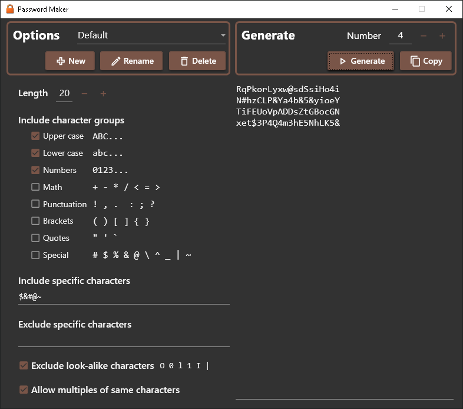

# Password Maker

Password Maker is a simple application that makes random strings that one can use as passwords and in other spots where a random string is useful.

## Web Version

There's a web (Blazor) version that you can run from here: <a href="https://thomas-taylor.github.io/passwordmaker/">Password Maker</a>

## Desktop Version
The WPF version looks like this:

## How it Works
- The code runs entirely locally; it makes no web service calls.
- So all passwords are yours alone, with no chance for interception (well, at least over the Internet; I don't know about on your computer).
- Of course, use this software at your own risk.
- The only output mechanism for generated passwords is the clipboard.
- This application is really just a 'fancy' wrapper on System.Security.Cryptography.RandomNumberGenerator.
- As shown in the screenshot above, there are several options to control which characters to include, and you can save multiple sets of options.  On Windows, option settings are saved in %LOCALAPPDATA%\PasswordMaker.  In a browser options are saved to local storage.

## Additional User Interfaces
- An Avalonia UI version might come next. I'd like to make Android, Browser, and Desktop versions.
- I started with a command-line version years ago, but it is out-of-date. If you think that would be useful, let me know, or I'd be happy to have a PR.